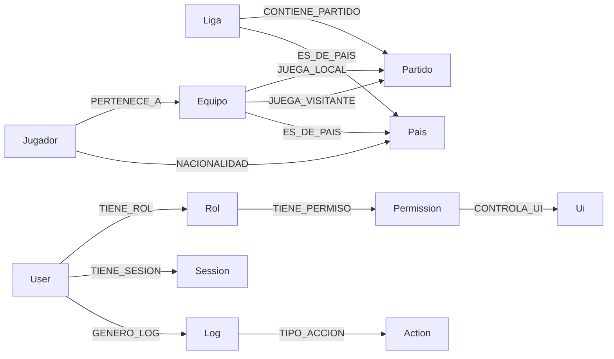

# Strike · Neo4j

Aplicación de escritorio en **Java + JavaFX** para gestionar estadísticas de fútbol: países, ligas,
equipos, jugadores y partidos. Proyecto del **Taller de Base de Datos** de la Universidad Mayor de
San Simón (UMSS), semestre II/2025.

Strike se implementó cuatro veces: la misma aplicación sobre cuatro tecnologías de datos distintas.

| Repositorio | Tecnología de datos | Enfoque |
|---|---|---|
| [strike-postgresql](https://github.com/dpardo23/strike-postgresql) | PostgreSQL + JDBC | la lógica de negocio vive en funciones y procedimientos almacenados |
| [srtike-hibernate](https://github.com/dpardo23/srtike-hibernate) | PostgreSQL + Hibernate/JPA | mapeo objeto-relacional sobre el mismo esquema |
| **strike-neo4j** (este) | Neo4j | el dominio como grafo, consultado en Cypher |
| [strike-redis](https://github.com/dpardo23/strike-redis) | Redis + PostgreSQL | sesiones en caché que se refrescan con `LISTEN`/`NOTIFY` |

## Modelo en grafo

El mismo dominio que en la versión relacional, pero sin tablas intermedias: las relaciones son
aristas con nombre. 12 tipos de nodo:



## El control de acceso es un recorrido

Las pantallas que puede abrir un usuario salen de recorrer el grafo, filtrando por las
propiedades de las relaciones (por ejemplo, `TIENE_ROL.activo`):

```cypher
MATCH (u:User {id_user: $userId})-[ur:TIENE_ROL]->(r:Rol)
      -[rp:TIENE_PERMISO]->(p:Permission)-[pui:CONTROLA_UI]->(i:Ui)
```

Las altas crean el nodo y lo enlazan en la misma consulta, con `MATCH` + `CREATE` + `MERGE`.
Por ejemplo, un partido se conecta con la liga, el equipo local y el visitante.

## Tecnologías

Java 21 · JavaFX · Neo4j AuraDB (nube) · Neo4j Java Driver 5.24 · Cypher · Maven

## Ejecución

1. Tener una instancia de Neo4j (AuraDB o local) con los datos cargados.
2. Configurar URI, usuario y contraseña en
   `src/main/java/com/dpardo/strike/repository/DatabaseConnection.java`.
3. `mvn javafx:run`, o `mvn clean package` y luego `./instalar.sh` para crear un acceso directo
   en el menú de aplicaciones (Linux).
